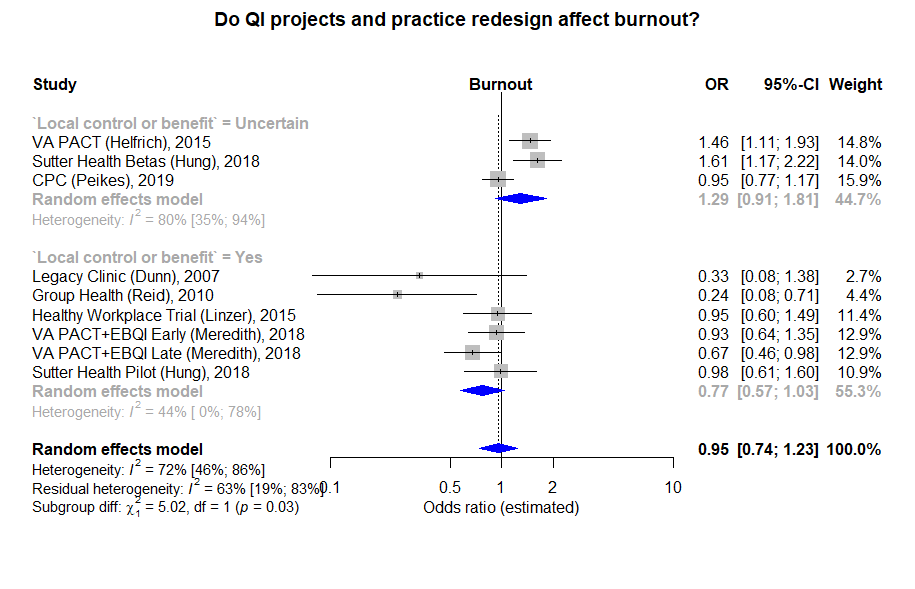

Burnout: effect of particpation in quality-improvement projects
============================================
A living systematic review

Short url: https://openMetaAnalysis.github.io/Burnout-and-quality-improvement

**Clinical summary:** This meta-analysis suggests that clinical intervention *is or is not* effective. Heterogeneity of results as measured by I2 was '[moderate](http://handbook-5-1.cochrane.org/chapter_9/9_5_2_identifying_and_measuring_heterogeneity.htm)' at XX%. This review updates the previously published meta-analysis.(1)

Meta-regression dooes not find modulators (year of publication, study size, event rate in the control groups) on the effect of the intervention.
* [Reconciliation of conclusions with prior meta-analyses](files/reconciliation-tables/Reconciliation%20of%20conclusions.pdf) (under construction)
* [Keep current with this topic](files/searching/Keep-up.md) (under construction)

Acknowledgement: we acknowledge the essential work by the authors of the prior systematic review(s) listed below.

**Methods overview:** This repository is an [openMetaAnalysis](https://openmetaanalysis.github.io/) that combines methods of scoping, rapid, and living systematic reviews.  This analysis updates one or more previously published review(s) below. A comparison of studies included in this review compared to prior reviews are in the table, [reconciliation of trials included with prior meta-analyses/](files/reconciliation-tables/Reconciliation%20of%20studies.pdf). Newer studies included are listed in the references below. Rationale for newer trials excluded may be listed at the end of the references. 
* [Methods](http://openmetaanalysis.github.io/methods.html) for openMetaAnalysis
* [Evidence search](files/searching/evidence-search.md) for this review (under construction)

**Results:** Details of the studies included are in the:
* [Reconciliation of trials included with prior meta-analyses/](files/reconciliation-tables/Reconciliation%20of%20studies.pdf) (under construction)
* [Description of studies (PICO table)](files/study-details/table-pico.pdf) (under construction)
* [Risk of bias assessment](files/study-details/table-bias.pdf) (under construction)
* [Forest plots](../master/files/forest-plots) ([source data](files/data))
* [Network plots](../master/files/network) (optional)
* [Reconciliation of conclusions with prior meta-analyses](files/reconciliation-tables/Reconciliation%20of%20conclusions.pdf) (under construction)

The forest plot for the primary outcomes are below. Additional [forest plots](files/forest-plots) of secondary analyses may be available. 

<!--
The meta-regression for the primary outcomes are below. Additional [meta-regressions](files/metaregression) of secondary analyses may be available. 

-->

References:
----------------------------------

### Systematic review(s)
#### Most recent review at time of last revision of this repository 
1. Kalani SD, Azadfallah P, Oreyzi H, Adibi P. Interventions for Physician Burnout: A Systematic Review of Systematic Reviews. Int J Prev Med. 2018 Sep 17;9:81. doi: [10.4103/ijpvm.IJPVM_255_18](http://dx.doi.org/10.4103/ijpvm.IJPVM_255_18). PMID: [30283613](http://pubmed.gov/30283613); PMCID: [PMC6151971](https://www.ncbi.nlm.nih.gov/pmc/articles/PMC6151971/).
  2. Brand SL, Thompson Coon J, Fleming LE, Carroll L, Bethel A, Wyatt K. Whole-system approaches to improving the health and wellbeing of healthcare workers: A systematic review. PLoS One. 2017 Dec 4;12(12):e0188418. doi: [10.1371/journal.pone.0188418](http://dx.doi.org/10.1371/journal.pone.0188418). eCollection 2017. PMID: [29200422](http://pubmed.gov/29200422); PMCID: [PMC5714334](https://www.ncbi.nlm.nih.gov/pmc/articles/PMC5714334/).
3. Panagioti M, Panagopoulou E, Bower P, Lewith G, Kontopantelis E, Chew-Graham C, Dawson S, van Marwijk H, Geraghty K, Esmail A. Controlled Interventions to Reduce Burnout in Physicians: A Systematic Review and Meta-analysis. JAMA Intern  Med. 2017 Feb 1;177(2):195-205. doi: [10.1001/jamainternmed.2016.7674](http://dx.doi.org/10.1001/jamainternmed.2016.7674). PMID: [27918798](http://pubmed.gov/27918798).
4. West CP, Dyrbye LN, Erwin PJ, Shanafelt TD. Interventions to prevent and reduce physician burnout: a systematic review and meta-analysis. Lancet. 2016 Nov 5;388(10057):2272-2281. doi: [10.1016/S0140-6736(16)31279-X](http://dx.doi.org/10.1016/S0140-6736(16)31279-X). PMID: [27692469](http://pubmed.gov/27692469).

### Randomized controlled trials
#### New studie(s) *not* included in the most recent review above
Pending

#### Studie(s) included in the review(s) above
1. Locatelli SM, LaVela SL. Professional Quality of Life of Veterans Affairs Staff and Providers in a Patient-Centered Care Environment. Health Care Manag (Frederick). 2015 Jul-Sep;34(3):246-54. doi: [10.1097/HCM.0000000000000070](http://dx.doi.org/10.1097/HCM.0000000000000070). PMID: [26218000](http://pubmed.gov/26218000).
2. Linzer M, Poplau S, Grossman E, Varkey A, Yale S, Williams E, Hicks L, Brown RL, Wallock J, Kohnhorst D, Barbouche M. A Cluster Randomized Trial of Interventions to Improve Work Conditions and Clinician Burnout in Primary Care: Results from the Healthy Work Place (HWP) Study. J Gen Intern Med. 2015 Aug;30(8):1105-11. doi: [10.1007/s11606-015-3235-4](http://dx.doi.org/10.1007/s11606-015-3235-4). PMID: [25724571](http://pubmed.gov/25724571); PMCID: [PMC4510236](https://www.ncbi.nlm.nih.gov/pmc/articles/PMC4510236).
3. Reid RJ, Coleman K, Johnson EA, Fishman PA, Hsu C, Soman MP, Trescott CE, Erikson M, Larson EB. The Group Health medical home at year two: cost savings, higher patient satisfaction, and less burnout for providers. Health Aff (Millwood). 2010 May;29(5):835-43. doi: [10.1377/hlthaff.2010.0158](http://dx.doi.org/10.1377/hlthaff.2010.0158). PMID: [20439869](http://pubmed.gov/20439869).
4. Dunn PM, Arnetz BB, Christensen JF, Homer L. Meeting the imperative to improve physician well-being: assessment of an innovative program. J Gen Intern Med. 2007 Nov;22(11):1544-52. PMID: [17891503](http://pubmed.gov/17891503); PMCID: [PMC2219814](https://www.ncbi.nlm.nih.gov/pmc/articles/PMC2219814).

#### Studie(s) undergoing review
1. Meredith LS, Batorsky B, Cefalu M, Darling JE, Stockdale SE, Yano EM, Rubenstein LV. Long-term impact of evidence-based quality improvement for facilitating medical home implementation on primary care health professional morale. BMC Fam Pract. 2018 Aug 31;19(1):149. doi: [10.1186/s12875-018-0824-4](http://dx.doi.org/10.1186/s12875-018-0824-4). PMID: [30170541](http://pubmed.gov/30170541)
2. Hung DY, Harrison MI, Truong Q, Du X. Experiences of primary care physicians and staff following lean workflow redesign. BMC Health Serv Res. 2018 Apr 10;18(1):274. doi: 10.1186/s12913-018-3062-5. PMID: [29636052](http://pubmed.gov/29636052); PMCID: [PMC5894127](https://www.ncbi.nlm.nih.gov/pmc/articles/PMC5894127).

#### Studie(s) excluded - selected list of important trial(s)
1. Salyers MP, Garabrant JM, Luther L, Henry N, Fukui S, Shimp D, Wu W, Gearhart T, Morse G, York MM, Rollins AL. A Comparative Effectiveness Trial to Reduce Burnout and Improve Quality of Care. Adm Policy Ment Health. 2018 Nov 28. doi: 10.1007/s10488-018-0908-4.  PMID: [30488144](http://pubmed.gov/30488144). *Did not study participatin in quality improvement*
2. Arnetz B, Blomkvist V. Leadership, mental health, and organizational efficacy in health care organizations. Psychosocial predictors of healthy organizational development based on prospective data from four different organizations. Psychother Psychosom. 2007;76(4):242-8. PMID:  [17570963](http://pubmed.gov/17570963). *Measured workforce mental health rather than burnout*

#### Cited by
This repository is cited by:

1. WikiDoc contributors. Pending content page. WikiDoc. Nov 9, 2014. Available at: http://www.wikidoc.org/index.php/This_topic. Accessed November 9, 2014. 

-------------------------------
[Cite and use this content](https://github.com/openMetaAnalysis/openMetaAnalysis.github.io/blob/master/reusing.MD)  - [Edit this page](../../edit/master/README.md) - [License](files/LICENSE.md) - [History](../../commits/master/README.md)  - 
[Issues and comments](../../issues?q=is%3Aboth+is%3Aissue)

